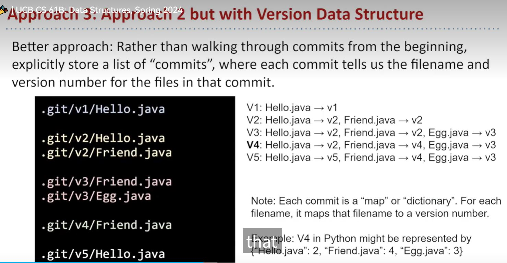
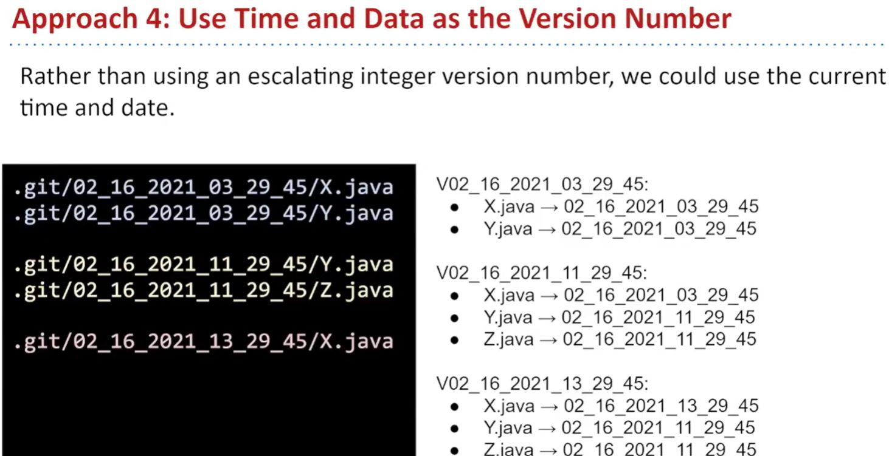
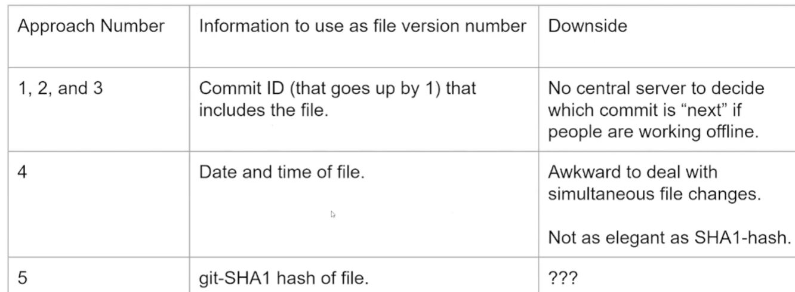
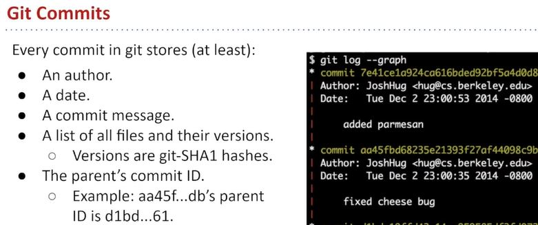
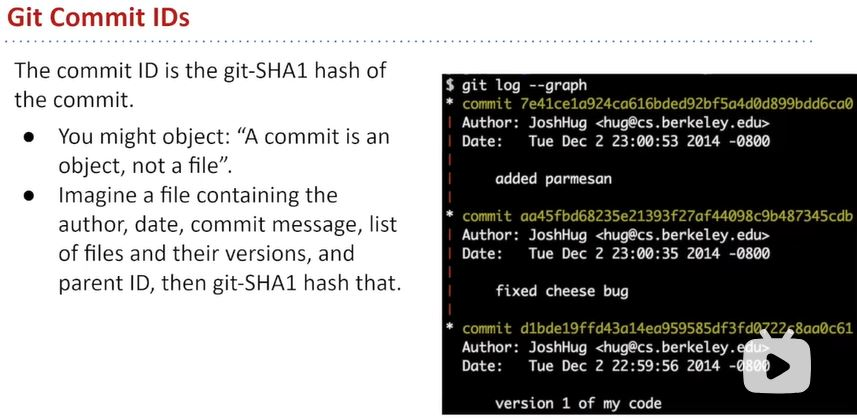
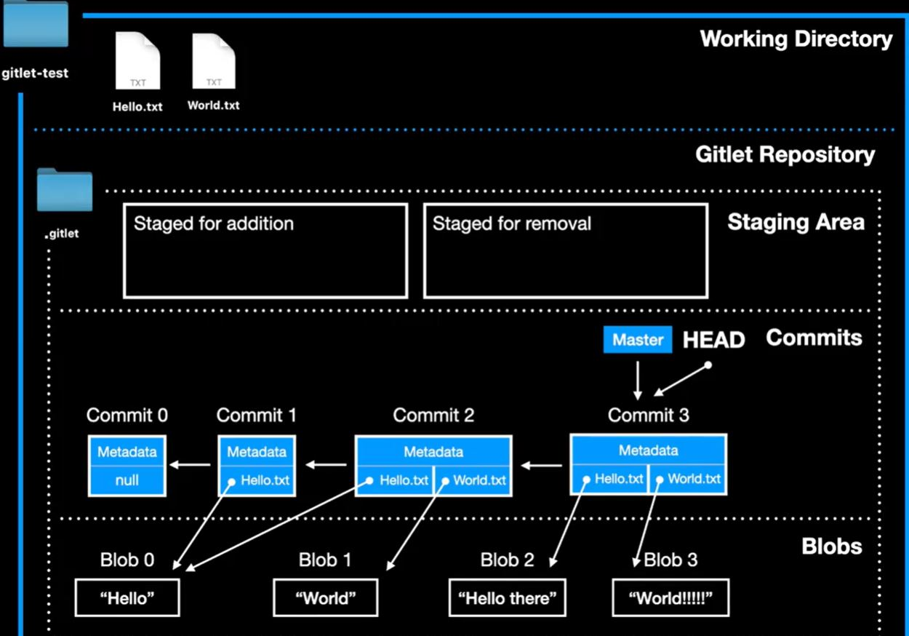

# lecture
## lab6
- ```javac xx.java```编译文件，生成```xx.class```文件
- 可以使用```javac *.java```
- ```java xx```执行`xx.class`文件，`xx`=类名
- 通常执行`Main`
- 执行包中的文件时，要在包的父目录下执行
  ```
  cd ..              #dir=lab6/
    java capers.Main
  ```
- ```System.getProperty("user.dir")``` 获取当前工作路径
- In IntelliJ, the CWD is given by the specified directory under Run > Edit Configurations > Working Directory
- ```cd ..```跳转父目录
- ```cd ../..```跳转爷目录
- `serialization`序列化

## proj2
- [Lecture[video]](https://www.bilibili.com/video/BV1QP4y1u7jv)
- [Gitlet项目设计引导[video]](https://www.bilibili.com/video/BV17V411Q7Ug)
- Real Git distinguishes several different kinds of objects. For our purposes, the important ones are

  - blobs: The saved contents of files. Since Gitlet saves many versions of files, a single file might correspond to multiple blobs: each being tracked in a different commit.
  - trees: Directory structures mapping names to references to blobs and other trees (subdirectories).
  - commits: Combinations of log messages, other metadata (commit date, author, etc.), a reference to a tree, and references to parent commits. The repository also maintains a mapping from branch heads to references to commits, so that certain important commits have symbolic names.
- Gitlet simplifies from Git still further by
  - Incorporating trees into commits and not dealing with subdirectories (so there will be one “flat” directory of plain files for each repository).
  - Limiting ourselves to merges that reference two parents (in real Git, there can be any number of parents.)
  Having our metadata consist only of a timestamp and log message. A commit, therefore, will consist of a log message, timestamp, a mapping of file names to blob references, a parent reference, and (for merges) a second parent reference.
- command
  - `init`
  - `add`
  - `commit`
  - `checkout -- [file name]`
  - `checkout [commit id] -- [file name]`
  - `log`
# from lecture
- 给的`.py`test也许有点问题，`lab6`并没有出现像样的界面
- `checkout v3`假设当前处于v5，则清空v5，然后将v3所有文件复制到v5(实际是复制所有文件的版本号)
- 关于commit
  - 每个repo应当有个commit列表，其中每个commit又包含每个文件对应的版本号，执行`commit`时，新增/有修改的文件/目录将版本号标记为当前commit号，没改动的文件/目录继承上一个commit里该文件的版本号
  - 
  - 由于`checkout`功能，存在`commit-v5`：`a.java.v1`; `commit-v4`：`a.java.v4`的情况
  - 两个人分别修改v3的***不同文件***后，分别执行`commit`将如何处理（不应按时间顺序执行
  - 使用时间+日期作为版本号，以解决不同终端提交的冲突问题，实际会使用sha1-hash后的名字
  - 
  - 
  - commit元素包含的内容，以下内容作为`Commit.java`中的字段
  - 
  - 关于commit id
  - 
- TA的图示
- 
# memos
- git bash下`make`等于编译所有`.java`文件，文件注释中有中文会导致报错
- 解决命令行时的中文乱码报错问题：
  - bash:`set JAVA_TOOL_OPTIONS=-Dfile.encoding=UTF-8`
  - IDE设置：IntelliJ: File > Settings > Editor > File Encodings
- 生成文档bash:`javadoc MyClass.java`
- 生成包文档bash:`javadoc -d docs com.mypackage`
- `.gitlet/`和`gitlet/`是同级目录
- 和`lab6`对比，`Dog`=`Commit`,`CapersRepository`=`Repository`
- deepseek说blob文件和commit文件都在objects下
- 如果add之后commit之前文件内容有修改也以add时的状态为准，所以生成blob在`add()`中进行
- 已经`commit`过的某文件，下一次如果没执行`add`的话，文件本身的修改不会提交。
- 即所有保存blob都在`add()`中;每次`commit`后暂存区会被清空
- 移出暂存区的操作：将Map<>`stagingArea`对应value置为`null`
- 关于`add`
  1. 若文件当前工作区版本与最近一次提交中的版本完全一致，则：
     - 不执行暂存操作
     - 若该文件已在暂存区，则将其移出（适用于文件被修改→暂存→又改回原版的情况）
  2. 若该文件已被标记为待删除（通过gitlet rm命令），执行add命令后将取消其待删除状态
  3. 这是因为对于场景：用户修改文件 → add → 又撤销修改恢复原状 → 忘记取消暂存，若不自动移出暂存区，会导致提交无实际变更的文件版本
- 关于测试
  - 舍弃官方的`makefile`
  1. git bash在`gitlet`目录下使用`javac *.java`
  2. 系统`cmd`在`testing`目录执行`python3 ..`测试。`python3 tester.py --verbose samples/test01-init.in`
# 进度
- apr17，lab6花了一整个白天（晚睡摸鱼版，蚌
- 本质上我没彻底搞明白git本身的步骤（我觉得是英语不精，实现应该还好，没有边缘问题
- may7,似乎要先解决Commit->Repository的结构问题，然后根据git命令加入method
- may8,各种功能放在`Repo`里，`branch`的结构没思路
- May22, 继续Repo,date问题解决之后优化一下commit对象的构造
- May22晚上，前面大概写写还没测试，目前进度checkout开始，明天先把add处理完
- Jun10,checkpoint过啦🥰能本地test之后效率果然高了，中间多sout方便排查捏
- 